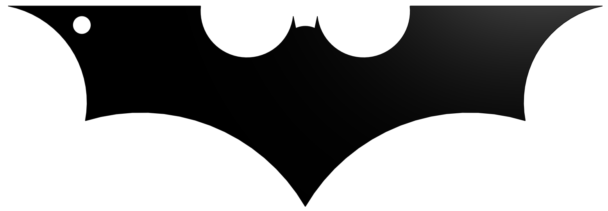
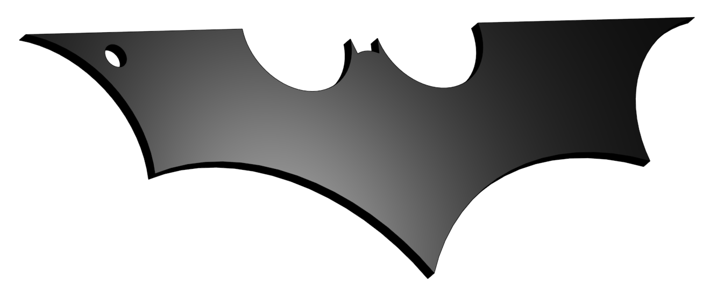

# 🦇 Batman Logo 3D Model

A simple 3D model of the Batman logo created as part of a CAD modeling assignment.

The model features a **4 mm mounting hole** and a **2 mm thickness**, making it suitable for 3D printing as a decorative item or keychain.

---

## 📖 Overview

This project demonstrates the fundamentals of 3D CAD modeling by designing the Batman logo from a 2D sketch and converting it into a printable 3D model.

The final design was exported in STL format for 3D printing.

---

## 🎯 Objective

The objective of this assignment was to practice basic CAD modeling by creating a recognizable 3D object with a specified thickness and a mounting hole.

---

## 🛠 Software

- Onshape

---

## 📂 Repository Structure

```text
Batman-Logo-3D/
│
├── Batman_Logo.stl
├── images/
│   ├── front.png
│   └── isometric.png
└── README.md
```

---

## 🖼 Preview

### Front View



### Isometric View



---

## 📄 STL File

The printable 3D model is provided in STL format and can be opened using most CAD software or slicing applications for 3D printing.

---

## 👨‍💻 Author

**Nawaf Alharbi**
